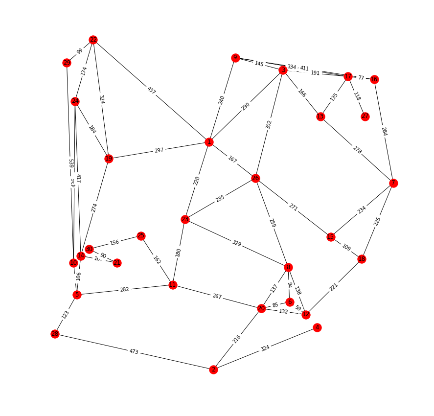

# plotGraph
Python notebook to plot graphs

  

Example of a graph file:

nodes(5).

start(2).

goal(3).

vertex(1,320,230).

vertex(2,460,270).

vertex(3,300,320).

vertex(4,380,310).

vertex(5,410,250).

arc(3,1,104).

arc(5,1,102).

arc(4,2,115).

arc(5,2,60).

arc(1,3,104).

arc(4,3,75).

arc(2,4,115).

arc(3,4,75).

arc(5,4,79).

arc(1,5,102).

arc(2,5,60).

arc(4,5,79).

